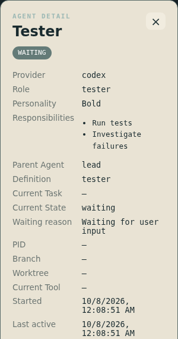

# Codex Native Runtime v1 (Phase 3B)

Phase 1 State Fidelity, Phase 2 Semantic Agent Model and Phase 3A Probe remain complete. Phase 3B v1 is complete. The probe and its historical evidence remain diagnostic; normal startup never imports backend/probe or writes probe JSONL.

## Architecture

```text
explicit binding API → runtime-local BindingRegistry
local daemon Unix WebSocket → version-gated ReadOnlyClient
    → content-free Codex facts → CodexNativeAdapter activity aggregation
    → AgentEvent(source=native) → OfficeRuntime arbitration + SemanticIdentityResolver
    → existing snapshot / agent.started / agent.updated / agent.stopped
```

The consumer is under backend/native/codex; normalization is backend/adapters/codex_native.py. Production transports retain no prompts, questions, reasoning, output, arguments, patches, or environments. A command is classified transiently with existing command classification and reduced to test/search/command; file paths are resolved off the event loop, scoped to the validated workspace and bounded. Only successful fileChange completion adds changed_files (last 100 paths). A command's numeric exit code is retained in metadata.native_exit_code; it does not turn a nonzero command into whole-agent ERROR.

## Enable and explicitly bind

Native integration defaults to disabled. Use config/native-codex.example.yaml or add this to an explicit local configuration:

```yaml
native:
  codex:
    enabled: true
    codex_binary: codex
    reconnect_seconds: 2
    terminal_seconds: 3
```

The executable is used only for `codex app-server daemon version`. Optional socket_path must equal the running daemon's reported socket. The integration never starts/restarts a daemon. There is no automatic CWD-based registration.

Native observation binds automatically after registration when launch identity is explicit:

```bash
uv run office-run codex --id lead --native-child-definition tester resume KNOWN_UUID

# Installed DevRouter passes its explicit resume argument through office-run:
devrouter --office -- resume KNOWN_UUID

# An explicit launcher can alternatively supply AGENT_OFFICE_NATIVE_THREAD_ID.
# For a currently registered agent, use the local CLI rather than curl:
uv run agent-office native bind lead KNOWN_UUID --child-definition tester
uv run agent-office native status
uv run agent-office native reconnect lead
uv run agent-office native validate --thread KNOWN_UUID
```

The wrapper removes its leading `--` delimiter before forwarding provider arguments. A literal resume UUID, --native-thread, or AGENT_OFFICE_NATIVE_THREAD_ID is explicit identity, not discovery; conflicting supplied/resume UUIDs fail before launch. Native child definition may also come from AGENT_OFFICE_NATIVE_CHILD_DEFINITION. The background handshake checks native enablement, supplies the exact registered started_at generation and retries for at most 30 seconds without blocking the TUI. Exit cancels the handshake; absent native integration leaves ordinary execution working. No nonce is invented or placed in prompts/configuration.

**Direct office-run:** explicit `resume UUID` automatically binds; new TUI/picker/session-name/--last has no deterministic binding and stays unbound. **DevRouter:** the installed tmux → office-run → Codex path supports the same literal-resume handshake and inherited explicit UUID. Its normal fresh-session path also remains unbound. A known UUID is still required from the launcher/operator when launching a fresh session; `native bind` removes the HTTP/JSON step but does not discover that UUID. Neither path guesses among same-workspace candidates. UUIDs obtained from controlled structured thread creation are experiment evidence, not automatic discovery of ordinary users' threads.

Native CLI HTTP commands require a loopback http server; override it before the subcommand, e.g. `agent-office native --server http://127.0.0.1:8001 status`. Bind fetches the Office generation and submits it; stale registration/restart during the handshake returns a conflict. The existing bind API retains optional expected_generation for backward compatibility, while all new CLI/wrapper handshakes provide it.

The optional child_definition_id is an explicit organizational assignment to children of this binding, inherited by their children. It is never guessed from prompts, nicknames or current tools. Existing project scope/definition matching remains in SemanticIdentityResolver. Omit it for generic native subagent fallback names; this v1 does not automatically decide which child is Tester versus Reviewer.

POST bind requires both IDs and an already-registered Codex Office Agent. The native thread must already be loaded (active/idle), and its CWD must match that agent's registered repository/worktree. A repository alone fails validation. Native threads map one-to-one to Office IDs; matching retries are idempotent, conflicts return 409, unknown Office IDs return 404, and disabled/unsupported/unavailable sources return 503 without native error content. If the source subsequently fails, the accepted binding remains sticky and status reports unavailable. GET status reports version, bindings, connection state and categorical failure type, never raw native errors.

Generation checks compare timezone-aware datetime instants normalized to UTC, not serialized strings. Equivalent `Z`, `+00:00` and explicit offset representations match exactly to microsecond precision. Supplied generations must contain a full ISO date/time with seconds and an explicit timezone; naive/date-only/malformed values, unknown `-00:00` offsets and precision beyond six fractional digits fail closed with HTTP 409 before native reads. Different instants remain stale, and registration is rechecked after native validation. The optional field remains omittable for legacy API clients; manual CLI and explicit-resume wrapper handshakes still always supply it.

Bindings retain the Office instance's started_at generation and survive reconnects. A new instance reusing the same Office ID cannot inherit the old binding silently. Binding identity, including completed child tombstones, is retained up to 1,024 records for this OfficeRuntime session; capacity exhaustion fails clearly rather than evicting identities. Server restart requires explicit rebinding. No database or persistent registry is added.

## Fresh-session operator workflow

Fresh automatic binding is an **UPSTREAM / RUNTIME LIMITATION** in the exercised current paths. [The focused investigation](runtime-probe/FRESH_SESSION_CORRELATION.md) records actual concurrent direct/DevRouter launches, failed nonce candidates and reconnect evidence. No v1.2 binding change is implemented.

1. Start `office-run codex --id lead` normally, or `devrouter --office`. Native observation remains unbound; existing wrapper/process fallbacks continue.
2. Obtain the **exact UUID of that session** from operator-controlled Codex session information or an explicitly owned structured creation response. Do not select a candidate by repository, newest session, name, timing or OS process. This project supplies no reliable fresh UUID discovery command; if the operator cannot establish exact ownership, leave it unbound.
3. Use `uv run agent-office native bind lead EXACT_UUID`, then `uv run agent-office native status`. For DevRouter, use the Office ID listed in status rather than `lead`. No curl/API payload construction is necessary. Native integration must be enabled and that native thread loaded.
4. For later known-ID launches, use `office-run codex --id lead resume EXACT_UUID` or `devrouter --office -- resume EXACT_UUID` for the existing automatic explicit handshake. Resume requires a resumable session; do not inject a turn merely to materialize an empty experiment thread.

Installed DevRouter uses one repository-derived Office ID even across separate homes. Do not bind two concurrent same-repository DevRouter sessions to that shared ID. Use distinct explicit office-run IDs for independently monitored concurrent sessions; this investigation does not change the external router. Both paths lack fresh automatic correlation, and the router has this additional identity limitation.

The PATH CLI 0.160.0 fresh launch encountered a daemon feature mismatch during this investigation. Do not restart the shared daemon or change shared features to bypass it. The evidence run used the already-installed matching 0.161.0 binary via an isolated experimental PATH, not an application/configuration upgrade. Unknown versions still fail closed.

## Read-only observation and version compatibility

Reviewed exact app-server versions are 0.159.3, 0.160.0, 0.160.1 and 0.161.0, selected through profiles.py. There is no open-ended compatible-version range. Phase 3A supplied actual facts for the first two; Phase 3B production smoke exercises daemon 0.160.1 with CLI 0.160.0. Local 0.160.0/0.160.1 schemas have matching ThreadItem, SubAgentActivityKind, Turn and ThreadItemEntry definitions. The v1.1 review additionally compares 0.161.0 Thread/ThreadStatus/Turn/ThreadItem/ThreadItemEntry/SubAgentActivityKind against 0.160.1 and exercises the consumed subset on the actual daemon. The initialize userAgent must agree with daemon discovery; unknown versions or mismatches fail closed to fallbacks. Older profiles are not claimed to have undergone the new production smoke.

Only initialize, thread/read, thread/resume(excludeTurns=true), thread/turns/list and thread/items/list are allowed. No configuration override is permitted on resume. Initialized is the only notification the consumer sends; it never responds to server requests, approves, starts/interrupts turns, changes TUI settings, loads an unloaded thread or stops the daemon. Closing the diagnostic/production socket is not agent death. The WebSocket dependency already existed transitively; it is now declared directly (>=13,<18), with the locked version unchanged.

Reconnect first checks loaded metadata. It reconciles structural snapshots of the selected thread and confirmed children; initial subscription looks at the latest turn, while reconnect scans back to its last observed turn (maximum 32 turns). Items are paginated with a maximum 800 per turn; free-text history is projected away before retaining facts. Past completed, unbound children are not manufactured as new agents. Known loaded children continue independently even after their Office parent exits. Oversized catch-up, malformed selected structures, queue overflow or unavailable metadata degrade the affected thread, without inferring a result. Typed transport loss/timeout and unknown handshake affect that root connection. Children multiplex on the existing root connection; sibling/root reads continue after a child rejection. Per-thread reconstruction retries use the same socket. A root read failure does not release independently observed children; root transport loss releases its connection scope. Unrelated roots remain isolated. Child reconnect requests retry that child without closing the root socket.

## Replay, concurrency and waiting

The bounded LRU event key is `(thread, turn, item, request, fact kind, lifecycle phase, child)`. Request resolution is correlated to the recorded request's turn/item; request-ID reuse in a later turn does not inherit old resolution. Separate completed-item and retired-turn caches prevent a replayed start from reviving completed activity. Pending-request replay reconstructs waiting after release/reconnect but does not repeatedly broadcast an unchanged display. Status notifications have no stable event ID: derived display equality deduplicates them rather than caching a permanent "idle" key. Event/completion caches hold 8,192 entries each, retired turns 1,024, and the event queue 512 structural facts per root connection (128 per thread). Pending child retries are bounded to 1,024 structural facts. Active items are limited to 256 per thread.

Current activities are reconciled centrally in this order:

1. Explicit terminal turn outcome for a child/failure.
2. Pending request or waitingOnUserInput → WAITING / waiting_reason=user_input.
3. Native wait with exactly one mapped, live, immediate child → WAITING / child_agent / waiting_on_agent_id.
4. Classified native test command → TESTING.
5. Classified native search command → SEARCHING.
6. Active native fileChange → CODING.
7. Other active native command → TOOL_RUNNING.
8. Confirmed idle → IDLE; otherwise a released THINKING baseline.

TESTING/SEARCHING are classifications of native command facts, not provider-native state names. Empty or multiple wait recipients do not manufacture child waiting. Having an active child alone never makes a parent WAITING. Successful file completion removes only that item and cannot end a concurrent test. Resolution clears only the correlated pending request; idle cannot erase an unresolved user request. Turn completion clears the turn's active context.

Agent adds optional waiting_reason and waiting_on_agent_id, both default None. AgentPanel displays user-input/child-agent waiting through normalized fields. OfficeScene and state-to-zone mappings are unchanged. Existing payloads and WebSocket message types remain valid.

Reasoning is diagnostic-only in this version: no continuous authoritative THINKING is claimed. When no specific native activity remains, the normalized baseline explicitly releases its native evidence. On disconnect, release clears unverified tool/wait context without stopping the agent or changing terminal outcomes. OfficeRuntime retains the latest private ToolObserver aggregate even when stronger native activity rejects its display; release restores a still-active fallback command with its original source tier. A finished fallback is not revived. Otherwise the released baseline permits wrapper/process/timeout behavior. A newer ToolObserver snapshot that was observed before the release but arrived afterward reconciles at the restored handoff timestamp floor; ordinary stale status events still fail. Recency and priority still apply; all legacy native events without release remain protected as before. Repeated outage retries do not reset the idle clock.

## Subagent identity and lifecycle

A subAgentActivity child ID must be corroborated by metadata.parentThreadId and the parent's explicit binding; OS PPIDs never create organizational children. Its Office ID is a stable hash-based runtime identifier, independent of PID. Generated nickname is retained as native_nickname and its name is explicitly marked generated: it has fallback name authority. Null native role is absence, so project roles/responsibilities survive. A genuine non-generated native semantic name/role still has native authority.

A successful child turn becomes DONE, failed turn ERROR, with tool/wait context cleared; no result text is parsed or relayed. Completion activity alone requires a successful/failed child turn snapshot before claiming terminal outcome. A configurable terminal grace defaults to three seconds before normalized agent.stopped. Duplicate completed spawn/activity cannot recreate a child. A genuinely fresh inProgress child turn can cancel grace or reopen the same sticky identity; old retired turns cannot do so. This structural recovery is covered by contracts; live repeated reuse is not claimed as universally verified.

## Remaining limits and next step

User-input waiting is confirmed in Plan mode; normal conversational questions, approval waits and remote MCP semantics are not universally normalized. Stable native roles were null in real smoke. Child waits with absent/multiple recipients remain partial, and natural-language results/task changes are not inferred. Fresh-session launch correlation, broad protocol compatibility, catch-up beyond bounded limits and long-running reuse remain future work. Explicit-resume DevRouter handshakes and per-thread failure isolation are implemented in v1.1. Phase 4 should follow that reliability work; rooms/org charts/NLP/filesystem observers remain out of scope.

See docs/ACCEPTANCE.md for exact final checks and real-runtime evidence. Synthetic transport/history tests verify contracts only, not provider capabilities.

## Phase 3B real smoke evidence

The final controlled run on 2026-10-07 UTC used CLI 0.160.0, daemon 0.160.1, an owned disposable committed repository and a real `office-run codex ... resume UUID` TUI. The UUID came explicitly from the experiment owner's native thread/start; it was passed to the production binding API. The production consumer never started a turn, answered a request or changed TUI/daemon configuration. Only the separate experiment owner initiated its fixture turns and answered its own required arithmetic-contract question.

The following are minimal structural extracts of actual notifications, with consistent pseudonymous IDs and workspace-relative paths. Timestamps are recorder arrival times; sequences preserve ordering. Command classification is derived, while start/completion and exit code are native facts. Question text, arguments, output, reasoning, diffs and result content are omitted. They are evidence extracts, not a new frontend protocol.

```jsonl
{"sequence":88,"timestamp":"2026-10-07T16:05:34.343897+00:00","raw_type":"item/started","thread_id":"id-40e0eb5447afe94b9591","item_type":"fileChange","item_id":"id-1d87e6eb5a90b94f1371","status":"inProgress","paths":["calc.py"]}
{"sequence":89,"timestamp":"2026-10-07T16:05:34.404552+00:00","raw_type":"item/completed","thread_id":"id-40e0eb5447afe94b9591","item_type":"fileChange","item_id":"id-1d87e6eb5a90b94f1371","status":"completed","paths":["calc.py"]}
{"sequence":140,"timestamp":"2026-10-07T16:05:44.308148+00:00","raw_type":"item/started","thread_id":"id-40e0eb5447afe94b9591","item_type":"commandExecution","item_id":"id-b35addbef565ba0fa557","classified_executable":"pytest","exit_code":null}
{"sequence":144,"timestamp":"2026-10-07T16:05:44.819513+00:00","raw_type":"item/completed","thread_id":"id-40e0eb5447afe94b9591","item_type":"commandExecution","item_id":"id-b35addbef565ba0fa557","classified_executable":"pytest","exit_code":0}
{"sequence":195,"timestamp":"2026-10-07T16:05:53.425131+00:00","raw_type":"thread/status/changed","thread_id":"id-40e0eb5447afe94b9591","status":{"type":"active","activeFlags":["waitingOnUserInput"]}}
{"sequence":196,"timestamp":"2026-10-07T16:05:53.425242+00:00","raw_type":"item/tool/requestUserInput","thread_id":"id-40e0eb5447afe94b9591","request_id":"id-4e07408562bedb8b60ce","item_id":"id-6765da04d43293b29951"}
{"sequence":198,"timestamp":"2026-10-07T16:06:14.410746+00:00","raw_type":"serverRequest/resolved","thread_id":"id-40e0eb5447afe94b9591","request_id":"id-4e07408562bedb8b60ce"}
{"sequence":255,"timestamp":"2026-10-07T16:06:25.538225+00:00","raw_type":"item/started","thread_id":"id-40e0eb5447afe94b9591","item_type":"subAgentActivity","item_id":"id-359ba4011b4729214756","kind":"started","child_thread_id":"id-fa98c471bbd57c25e4f3"}
{"sequence":324,"timestamp":"2026-10-07T16:06:48.189531+00:00","raw_type":"item/started","thread_id":"id-40e0eb5447afe94b9591","item_type":"subAgentActivity","item_id":"id-4429de3159a57d546311","kind":"completed","child_thread_id":"id-fa98c471bbd57c25e4f3"}
```

A metadata-only read of that same real child confirmed `parentThreadId == bound root`, `agentNickname = "Sagan"`, `agentRole = null`, and final native status `idle`. The production Agent instead displayed **Tester**, role **tester**, responsibilities **Run tests**, definition **tester**, and the correct Office parent. There was exactly one child registration across reconnect; its successful turn produced DONE, then removal after the three-second grace. No child result text was copied.

The final run recorded 37 normalized structural messages and passed explicit binding, real apply_patch (calc.py 41→42 independently checked), real rg/shell/pytest, WAITING/user_input, reconnect while the request remained pending, owner resolution and recovery, native child spawn/parent/definition precedence/completion, and reconnect without duplicate agents. Consumer loss was deliberately injected afterward: fallback TOOL_PROCESS input produced TESTING and frontend HTTP stayed available. Separate browser checks during consumer loss observed a valid WebSocket snapshot and Office canvas without page errors. This fallback input is a controlled normalized fixture, not additional native or real-process capability evidence; the existing ToolObserver regressions cover process behavior.



The screenshot is a separate normalized UI fixture demonstrating role, responsibilities, parent and user-input waiting. It is not provider capability evidence. No probe logs, owned UUIDs, disposable repository paths or personal configuration are checked in.

## v1.1 diagnostic contract

GET /api/native/codex is a local developer control-plane API. It reports enabled, provider, version, protocol (unknown/supported/unsupported), aggregate health, bindings and unbound Office IDs. Binding rows retain thread_id/root_thread_id for operator ownership checks and add status, fallback_active, failure_scope, failure_category and failure_type. The latest binding failure is categorical and bounded; pending child read failures appear separately until native parent metadata is corroborated. No native UUID enters the frontend/domain model. No free-form native error text is returned.

Health is independent of AgentState: disabled, unbound, connecting, connected, reconnecting, degraded, unsupported, unavailable or inactive. A connection can remain connected while a child is degraded. fallback_active means current accepted status evidence is non-native or explicitly released, rather than asserting that a process fallback can observe every daemon tool. Terminal outcomes remain protected. Repeated failed recovery releases evidence only once, clears unconfirmed user waiting, and never refreshes last_active_at just to show a retry.

`native validate` reports only version/schema, completed check names and a failed-check category. With no thread it checks discovery/initialize; with an explicit already-loaded thread it checks read, no-override subscription, latest-turn and item page shapes. Empty history cannot prove item RPC compatibility and that check is omitted. Unknown versions report review_required and remain production-disabled; inspect the installed generated schemas and collect owned real evidence before adding a reviewed profile. Validation is diagnostic, not a blanket guarantee about all runtime behavior.

## v1.1 runtime evidence

Owned disposable runs exercised CLI 0.160.0 with daemon 0.161.0. The direct wrapper and actual installed DevRouter each resumed a separately owned, explicitly supplied thread in the same workspace and automatically bound the correct Office ID without a user bind HTTP call. A first read-only turn materialized each resumable rollout. CLI status and selected-thread validate succeeded, including all reviewed read RPC checks.

The final run exits 0 with 44 normalized structural messages. Actual apply_patch, pytest/rg, Plan input waiting/resolution, child spawn/parent/Tester definition precedence (native nickname Kepler) and terminal cleanup remained observable. Read-only child hydration failure was deliberately injected after real child creation: only that child degraded while its root and the DevRouter root stayed connected. Closing the direct root consumer's actual observer socket released its evidence; the independent DevRouter thread still emitted native SEARCHING from a real rg command. CLI reconnect restored the direct connection without duplicate children. Synthetic fault injection and normalized fallback input are labeled as such, not additional provider capabilities. The observer never answered inputs or started turns; the separate fixture owner initiated its own turns/answers. Shared daemon configuration/lifecycle and unrelated sessions were unchanged. Full private captures/helpers remain ignored under runtime/probe; no UUIDs, prompts, question text, output or credentials are checked in.
